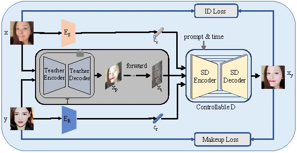

# MakeupDiffuse

Code for our paper "MakeupDiffuse: A Double Image Controlled Diffusion Model for Exquisite Makeup Transfer"

## framework

The network framework of the MakeupDiffuse model. The source $x$ and reference image $y$ first pass through the Teacher Module (T) to obtain a preliminary makeup transfer image $x_p$, then diffuse it and obtain latent image $x_t$. Finally, we input the diffused latent image $x_t$ and the content and style conditions($c_s$, $c_r$) extracted by the Source Face Encoder and Reference Makeup Encoder($E_S$, $E_R$) into the Controllable Stable Diffusion Module(Controllable D) for a precise and controllable generation.

## Some Results

Given some source-reference frontal image pairs (columns 1 and 2), our proposed method is qualitatively compared with the state-of-the-art methods. MakeupDiffuse could generate the most natural colors, shadows, and fewest artifacts, transferring results with the desired makeup style and high-quality details.

Qualitative comparisons with some state-of-the-art approaches in the non-frontal cases. MakeupDiffuse is more robust and could generate the desired makeup transfer results regardless of side faces, decorations, or occlusions.

Interpolated makeup transfer. Our proposed MakeupDiffuse could achieve smooth makeup interpolation transitions no matter in the case of a normal front face, partial face, occlusion, and obviously makeup style gap between reference and source face.

The influence of different teacher modules and ablation study by removing this module on the experimental results. Compared with the artifacts of the teacher network, inaccurate colors, fine details, and masked faces, our model results are more accurate and natural. After removing the teacher network, although the background and face can be generated with a relatively correct structure and has a little makeup, overall makeup information is lacking.

## More Results

The release code will be announced soon...
